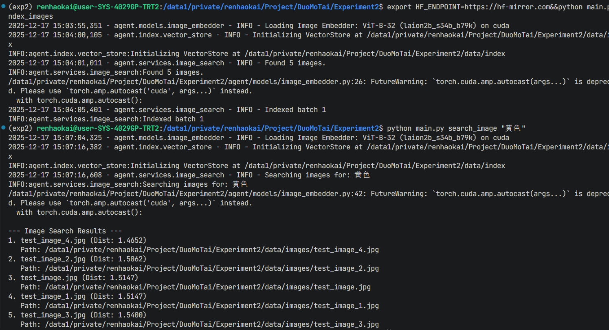

# 测试记录

## 1 论文相关功能测试
### 1.1 索引构建
使用setup_test_data_pdf.py生成了12篇测试论文，分别是CV、NLP、RL、DM、ML方向。放在了data/papers中。并使用如下命令生成了索引
```bash
# CV 相关论文
python main.py add_paper pdf/CV_paper_01.pdf --topics "目标检测,图像分割,特征提取" --move
python main.py add_paper pdf/CV_paper_02.pdf --topics "图像分类,卷积神经网络,边缘检测" --move
python main.py add_paper pdf/CV_paper_03.pdf --topics "物体识别,姿态估计,特征匹配" --move
# NLP 相关论文
python main.py add_paper pdf/NLP_paper_01.pdf --topics "文本分类,语言模型,词向量" --move
python main.py add_paper pdf/NLP_paper_02.pdf --topics "命名实体识别,序列标注,依存句法" --move
python main.py add_paper pdf/NLP_paper_03.pdf --topics "机器翻译,情感分析,预训练模型" --move
# RL 相关论文
python main.py add_paper pdf/RL_paper_01.pdf --topics "Q学习,价值函数,探索-利用" --move
python main.py add_paper pdf/RL_paper_02.pdf --topics "策略梯度,Actor-Critic,奖励设计" --move
python main.py add_paper pdf/RL_paper_03.pdf --topics "蒙特卡洛,时序差分,环境建模" --move
# DM 相关论文
python main.py add_paper pdf/DM_paper_01.pdf --topics "关联规则,频繁项集,市场篮分析" --move
python main.py add_paper pdf/DM_paper_02.pdf --topics "聚类分析,KMeans,层次聚类" --move
python main.py add_paper pdf/DM_paper_03.pdf --topics "异常检测,离群点,数据清洗" --move
# ML 相关论文
python main.py add_paper pdf/ML_paper_01.pdf --topics "监督学习,交叉验证,正则化" --move
python main.py add_paper pdf/ML_paper_02.pdf --topics "无监督学习,降维,特征选择" --move
python main.py add_paper pdf/ML_paper_03.pdf --topics "模型评估,偏差-方差,超参数调优" --move
```
### 1.2 检索
使用命令检索”让计算机处理人类语言的论文“。可以看到结果正确。
我特地使用了十分口语化的说法，同时指定了显示前5个内容（每一个类型的论文有三个）。可以看到NLP类的论文dist值都为1.8左右，而另外两个论文的dist值为1.85-1.86。形成了明显的两档。说明算法正确。


## 图像测试
我已经提前使用setup_test_data.py生成了4张测试图片，分别是红色、蓝色、绿色、黄色。放在了data/images中。并且生成了索引。
生成索引并搜索的测试样例如下。可以看到，正确的结果与其他结果的dis值存在明显差距。
