# 本地多模态 AI 智能助手 - 演示报告

## 1. 项目简介

本项目是一个基于 Python 的本地多模态 AI 智能助手，旨在解决本地大量文献和图像素材管理困难的问题。利用多模态神经网络技术（SentenceTransformers 与 CLIP），实现了对内容的**语义搜索**、**自动分类**以及**以文搜图**功能。

---

## 2. 环境启动

项目基于 Python 3.10 环境运行，依赖库已通过 `requirements.txt` 安装。

**启动命令：**
```bash
conda activate exp2
python UI/main_ui.py
```


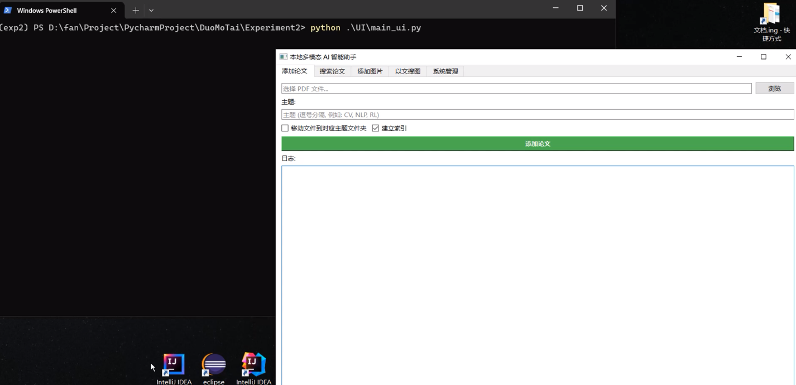
*图 1：项目启动后的 UI 主界面，包含“添加论文”、“搜索论文”、“添加图片”、“以文搜图”和“系统管理”五个功能模块。*


---

## 3. 核心功能演示

### 3.1 智能文献管理

#### 3.1.1 添加与分类论文

系统支持单篇论文的智能添加与分类。用户选择 PDF 文件并提供预设主题，系统会自动分析论文内容并将其归类到最匹配的主题目录下。

**案例一：计算机视觉 (CV)**
选择论文 `CV_Segment_Anything.pdf`，输入分类主题“计算机视觉”。系统成功识别并将其移动到 `data/papers/计算机视觉` 目录。

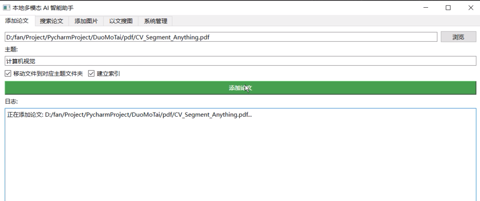
*图 2：添加计算机视觉相关论文*


*图 3：文件成功归档至计算机视觉文件夹*

**案例二：自然语言处理 (NLP)**
选择论文 `LLM_Chain_Of_Thought.pdf`，输入分类主题“自然语言处理”。系统分析后将其归类为 `大语言模型` 主题（假设用户预设或系统智能聚类），并移动到相应目录。

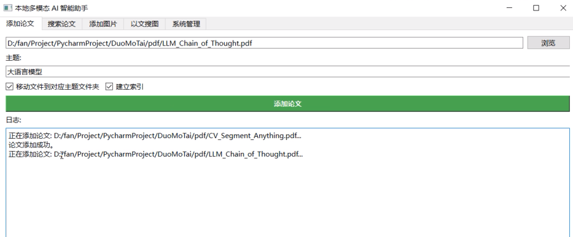
*图 4：添加大语言模型相关论文*

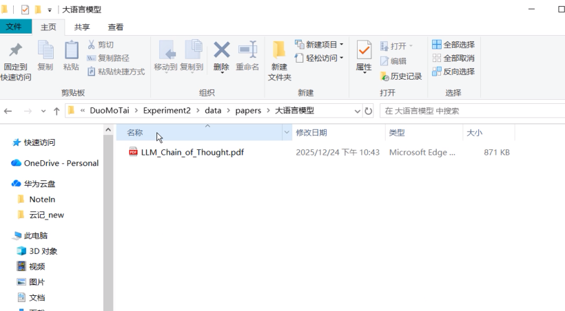
*图 5：文件成功归档至大语言模型文件夹*

**案例三：推荐系统 (RecSys)**
选择论文 `RecSys_DCN_V2.pdf`，输入分类主题“推荐系统”。系统准确识别并将论文归档至 `data/papers/推荐系统`。

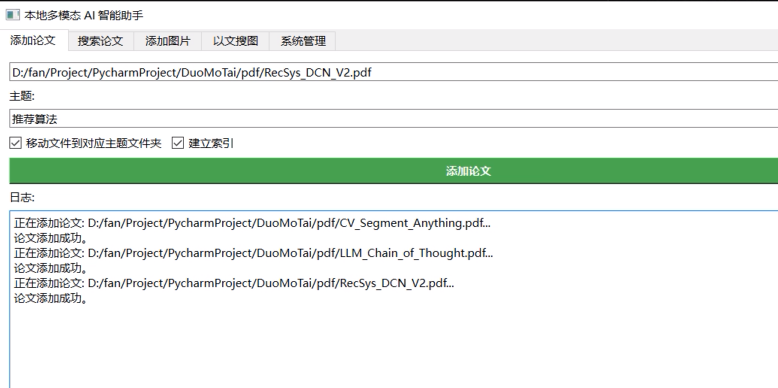
*图 6：添加推荐系统相关论文*

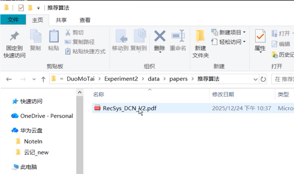
*图 7：文件成功归档至推荐系统文件夹*


#### 3.1.2 批量整理论文

针对现有的混乱文件夹，系统提供“批量整理”功能。它会自动扫描目录下的所有 PDF 文件，根据内容进行智能分类和移动。

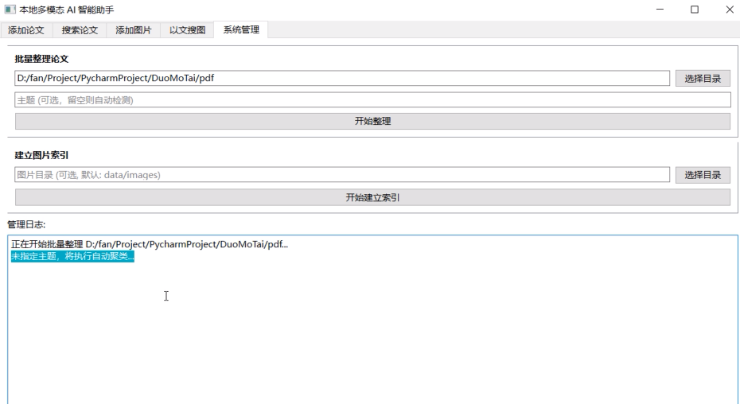
*图 8：启动批量整理任务*

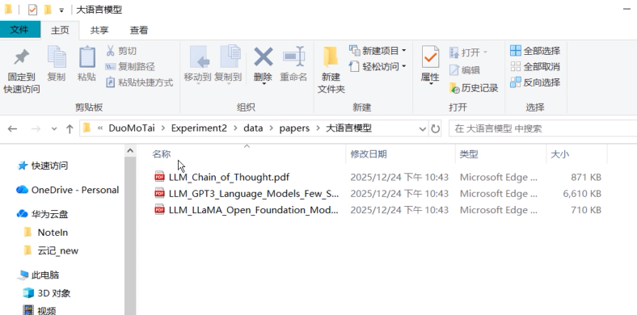
*图 9：大语言模型相关论文归类完成*

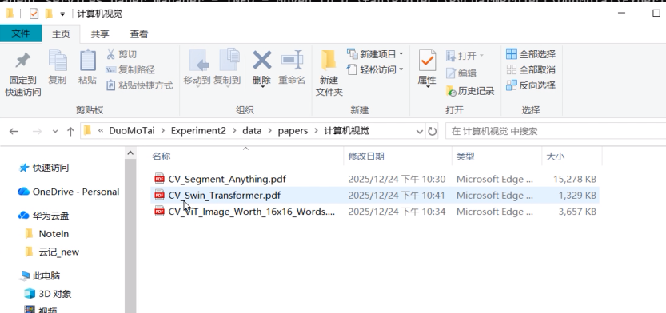
*图 10：计算机视觉相关模型归类完成*

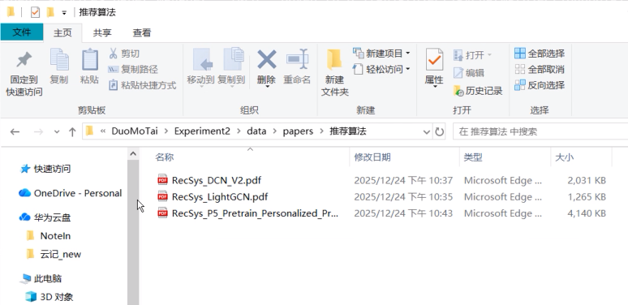
*图 11：推荐算法相关论文归类完成*

#### 3.1.3 语义搜索论文

系统支持基于自然语言的语义搜索，能够理解用户的查询意图，而不仅仅是关键词匹配。

**查询一：“让计算机看到东西”**
系统准确返回了与计算机视觉（CV）相关的论文，如 `CV_Segment_Anything.pdf`。

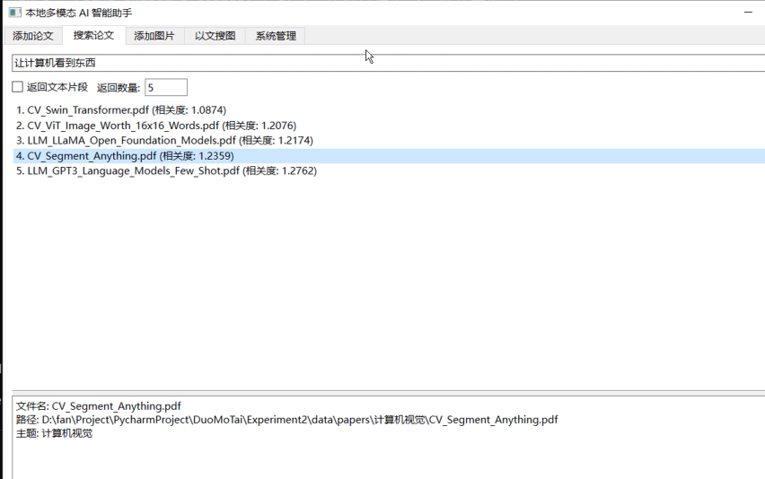
*图 12：搜索“让计算机看到东西”的结果*

**查询二：“让计算机能够理解并应用人类语言”**
系统返回了与自然语言处理（NLP）和大语言模型相关的论文，如 `LLM_Chain_Of_Thought.pdf`。同时，由于本次搜索时勾选了返回片段选项，系统返回了有关的论文片段。

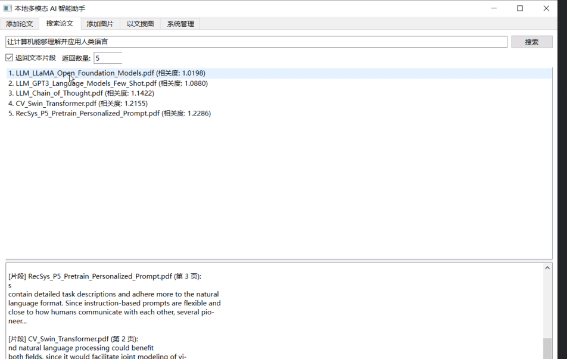
*图 13：搜索“让计算机能够理解并应用人类语言”的结果*


### 3.2 智能图像管理

#### 3.2.1 以文搜图

系统利用 **XLM-Roberta-Large-ViT-H-14** 模型实现了强大的“以文搜图”功能，**支持中文输入**，用户可以通过自然语言描述来查找本地图片。

**步骤一：建立索引**
首先指定图片目录，系统会自动提取目录下所有图片的特征并建立向量索引。

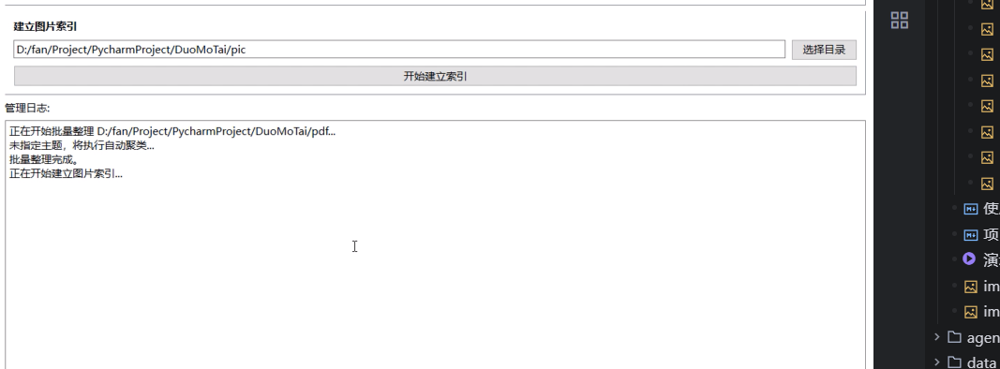
*图 14：索引指定目录下的图片库*

**步骤二：文本搜索**
输入描述“red”（或中文 "红色"），系统在图库中检索并展示了主色调为红色或包含红色元素的图片。

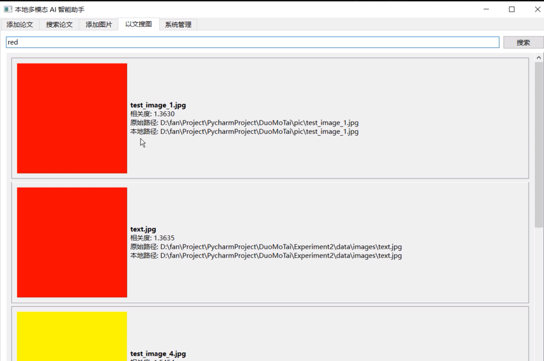
*图 15：搜索红色的检索结果*

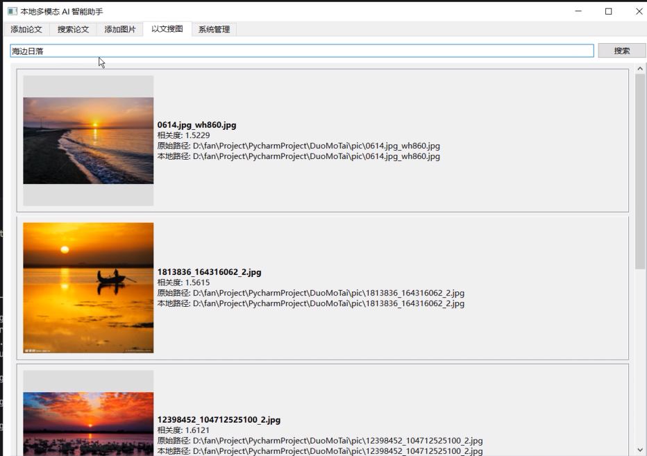
*图 16：搜索海边日落的检索结果*

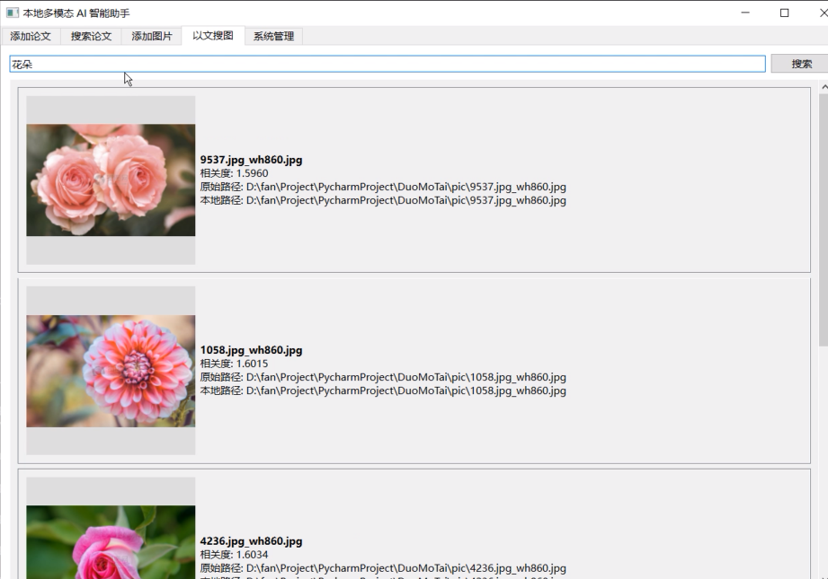
*图 17：搜索花朵的检索结果*
